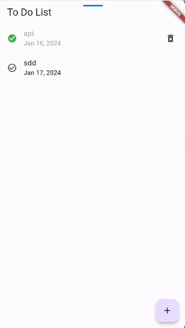

# todolist



## 화면 이동
- 다른 화면으로 이동하기 위해 `Navigator.push` 사용:
  ```dart
  IconButton(onPressed: () { Navigator.push(); }, ...)
  ```

## Stateful Widget
- 변수가 필요할 때는 Stateful Widget 사용.

## 값 반환
- `navpop`을 사용하여 값 돌려받기.

## Hive 사용하기
- [pub.dev](http://pub.dev)에서 Hive 관련 패키지 검색.
- Flutter에 Hive 관련 패키지 추가:
  ```shell
  flutter pub add hive_flutter
  flutter pub add hive_generator --dev
  ```

- Build runner 실행:
  ```shell
  flutter pub run build_runner build
  ```

- Hive 초기화를 위해 `main` 함수를 `async`로 변경하고 `await Hive.initFlutter();` 사용.

## ListScreen 업데이트
- `ListScreen`에서 `CreateScreen`으로 돌아올 때 UI를 새로고침하기 위해 비동기 처리:
    - `await async`: `CreateScreen`에서 todo를 추가하는 동안 `ListScreen`을 대기시킴.
    - `setState()`: `CreateScreen`에서 돌아오면 `ListScreen`을 갱신하여 추가한 todo를 바로 반영.

## 비동기 처리의 중요성
- 비동기 처리를 하지 않았을 경우의 문제점:
    1. **즉시 UI 업데이트가 되지 않음**
    2. **사용자 경험 저하**
    3. **데이터 동기화 문제**

## Todo 삭제 기능

### `todo_item.dart`

- 할 일 삭제를 위한 콜백 함수 정의:
  ```dart
  final Function(Todo) todoOnDelete;
  required this.todoOnDelete,
  ```

- 완료된 할 일에 삭제 아이콘 표시 및 삭제 기능 구현:
  ```dart
  trailing: todo.isDone
      ? GestureDetector(
          onTap: () {
            todoOnDelete(todo);
          },
          child: const Icon(Icons.delete_forever))
      : null,
  ```

### `list_screen.dart`

- `ListScreen`에서 할 일 삭제 기능 처리:
  ```dart
  todoOnDelete: (todo) async {
      await todo.delete();
      setState(() {});
    },
  ```
